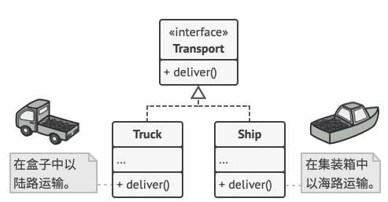

## 工厂模式

- [工厂模式](#工厂模式)
  - [1、抛出问题](#1抛出问题)
  - [2、解决方案](#2解决方案)
  - [3、工厂方法模式的应用场景](#3工厂方法模式的应用场景)
  - [4、实现方式](#4实现方式)

---
### 1、抛出问题

假设你开了一家快递公司，要开发一款物流管理软件，刚开始你只有`货车`提供运输业务，因此这款物流软件中大部分的代码围绕`货车`类进行开发。

过了一段时间，有了海外订单，`货车`不具备海上物流的能力；那就需要增加`轮船`类来实现海运部分的业务运输管理流程。

更糟糕的是，如果以后要增加新的运输方式，比如航空运输，那还得对这些代码进行大量的修改，增加`飞机`类，提供航空业务。

每次新加入一种运输对象，就不得不编写基于这个对象的不同处理逻辑。

### 2、解决方案

> `工厂方法模式` 通过定义工厂父类创建对象的公共接口（interface），子类负责生成具体的对象。

比如上面这个例子：货车`Truck`和轮船`Ship`类都必须实现运输`Transport`这个interface，该接口声明了一个名为`deliver`的method。每个子类都将以不同的方法实现这个deliver方法：货车走陆运交付货物，轮船走海运交付货物。管理系统中陆运逻辑中的工厂方法返回卡车对象，而海运逻辑中的返回的是轮船对象。

调用Factory Method的代码（客户端代码）不需要了解不同子类返回对象之间的差别。客户端将所有产品都视为抽象的`运输`，客户端知道所有的运输对象都具有`deliver`方法，客户端并不关心其内部具体的实现方式。

如下图所示：




### 3、工厂方法模式的应用场景

- 当你在编写代码的过程中，无法预知对象确切的类别和其依赖关系，可以使用工厂方法
- 如果你希望用户能扩展你的软件库或者框架的内部组件，可以使用工厂方法
- 如果你希望复用现有对象来节省系统资源，而不是每次都重新创建对象，可以使用工厂方法

---

### 4、实现方式

**`本文代码详见：`**

https://github.com/curpointer/design-pattern

代码实现

> 文件transport.go

```go
import "fmt"

type iTransport interface {
	SetName(name string)
	GetName() string
	Deliver()
}

func GetTransport(transportType string) (iTransport, error) {
	switch transportType {
	case TRANSPORT_LAND:
		return NewTruck(), nil
	case TRANSPORT_SHIPPING:
		return NewShip(), nil
	default:
		return nil, fmt.Errorf("not matched transport")
	}
}

func PrintTransport(i iTransport) {
	fmt.Printf("Transport is:%s\n", i.GetName())
	i.Deliver()
}

```

> 文件ship.go

```go
package transport

import "fmt"

type ship struct {
	name string
}

func (s *ship) SetName(name string) {
	s.name = name
}

func (s *ship) GetName() string {
	return s.name
}

func (s *ship) Deliver() {
	fmt.Printf("A ship delivers goods, the name of ship is %s\n", s.GetName())
}

func NewShip() iTransport {
	return &ship{
		name: "bird",
	}
}
```

> 文件truck.go

```go
package transport

import "fmt"

type truck struct {
	name string
}

func (t *truck) SetName(name string) {
	t.name = name
}

func (t *truck) GetName() string {
	return t.name
}

func (t *truck) Deliver() {
	fmt.Printf("A truck delivers goods, the name of truck is %s\n", t.GetName())
}

func NewTruck() iTransport {
	return &truck{
		name: "panda",
	}
}
```

> 文件enums.go

```go
package transport

const (
	TRANSPORT_SHIPPING = "ship"
	TRANSPORT_LAND     = "truck"
)
```

> 文件transport_test.go

```go
package transport

import "testing"

func TestTransport(t *testing.T) {
	ship, _ := GetTransport(TRANSPORT_SHIPPING)
	ship.SetName("sasa")
	PrintTransport(ship)
	truck, _ := GetTransport(TRANSPORT_LAND)
	truck.SetName("tata")
	PrintTransport(truck)
}
```

运行结果：

`go test -v`

```go
=== RUN   TestTransport
Transport is:sasa
A ship delivers goods, the name of ship is sasa
Transport is:tata
A truck delivers goods, the name of truck is tata
--- PASS: TestTransport (0.00s)
PASS
ok      transport/transport     0.461s
```
---


